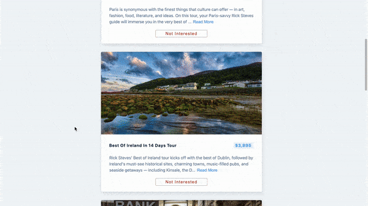

## Summary

An introduction to 5 tours 

- Loading status while fetching API
- Read more / show less button to toggle paragraph
- Remove each tour by clicking the "Not Interested" button
- Refresh button after removing all tours



## File structure

```
.
├── README.md
├── package-lock.json
├── package.json
└── src
    ├── App.js
    ├── Loading.js
    ├── Tour.js
    ├── Tours.js
    ├── index.css
    └── index.js
```

## Available Scripts

In the project directory, you can run:

### `npm start`

Runs the app in the development mode.\
Open [http://localhost:3000](http://localhost:3000) to view it in your browser.
